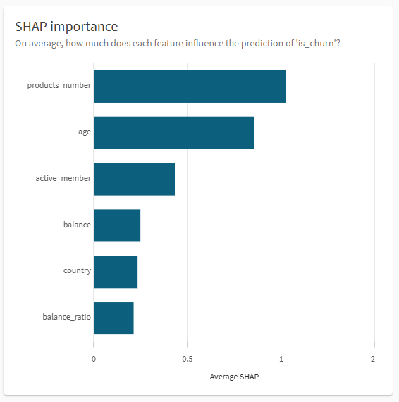
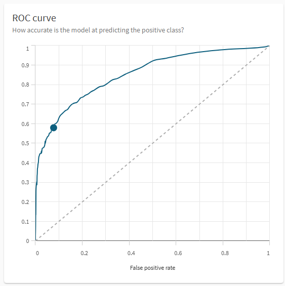

# TD 2 — Modélisation & Entraînement du modèle AutoML

## Objectif
Dans cette partie, nous allons créer et entraîner automatiquement un modèle de machine learning à partir du dataset préparé dans le flux de données.

---

## Étape 1 — Créer une expérimentation AutoML

1. Dans **Qlik Cloud**, allez dans le menu **Analytics → Create → ML Experiment**.  
2. Donnez le nom : `ML_Churn`.  
3. Sélectionnez le dataset **`Churn_train.qvp`** généré lors du flux précédent.

---

## Étape 2 — Configuration de l’expérimentation

1. Choisissez la **colonne cible (Target)** : `is_churn`.  
2. Sélectionnez comme **variables catégorielles** :`product_number`, `credit_card`, `is_churn`
3. Désélectionnez les champs inutiles pour l’entraînement :`churn`, `rand_key`, `customer_id`, `split`

---

## Étape 3 — Choix des algorithmes et paramètres

1. Cochez **tous les algorithmes** (Qlik testera plusieurs modèles : CatBoost, LightGBM, Random Forest, etc.).
2. Dans la section **Model Optimization**, choisissez :
   - **Mode :** Intelligent
   - **Timeout :** 1 heure  
     > *Si un modèle n’a pas terminé son apprentissage après ce délai, Qlik terminera la version courante avant d’arrêter le processus.*

3. Cliquez sur **Run Experiment** pour lancer l’entraînement.

---

## Étape 4 — Analyse des résultats

Une fois l’expérimentation terminée :
- Dans le panneau de gauche, vous pouvez consulter **tous les modèles testés** avec leurs scores :
  - **F1-score**
  - **Accuracy**
  - **Prediction speed**
- Qlik sélectionne automatiquement le **Best Model**.

---

## Étape 5 — Affiner le modèle

1. Revenez dans l’onglet **Data**.  
2. Sélectionnez uniquement les colonnes suivantes :
   - `country`, `age`, `balance`, `products_number`, `active_member`,  
     `balance_ratio`, `customer_id`, `is_churn`
3. Relancez une nouvelle expérimentation → **Version 2**.  
   > Cela permet d’uniformiser les colonnes pour comparaison pendant l'atelier.

Une fois l’entraînement terminé, vous verrez un nouveau **Best Model v02**.

---

## Étape 6 — Interprétation du modèle

### 6.1. Compréhension des métriques principales
Dans l’onglet **Analyze**, observez et **interprétez** :
- **F1 Score**, **Precision**, **Accuracy**, **Recall**, **Specificity**, **Miss rate**.  
- La **Matrice de confusion**, la **courbe ROC**, et les **SHAP values**.

**Question :**
1. Le modèle prédit-il mieux les clients churn ou les non-churn ?  
2. Que pourrait-on ajuster pour améliorer la détection des churns ?
3. Completez ce tableau :

| Indicateur | Valeur | Interprétation |
|-------------|---------|----------------|
| True Positives | .... | .... |
| False Positives | .... | .... |
| False Negatives | .... | .... |
| True Negatives | .... | .... |

---

### 6.2. Importance des variables (SHAP)

#### Question :
1. Analysez le graphique **Feature impact (SHAP)** à droite du tableau de bord.  
2. Quelles sont, selon vous, les variables les plus influentes dans la prédiction du churn ?  
3. En observant notamment l’importance de `age` et `products_number`, que pouvez-vous en déduire sur le **risque de churn** ?

---

## Étape 6 — Télécharger le rapport

1. Allez dans l’onglet **Models**.  
2. Cliquez sur **Download training report**.  
   > Cela génère un rapport PDF récapitulant les performances et les paramètres du modèle.

---

## Étape 8 — Déploiement du modèle

1. Dans l’onglet **Models**, cliquez sur **Deploy**.  
2. Donnez un nom au modèle déployé :  `Best_model_Churn`
3. Revenez à l’accueil Qlik accedez au modèle déployé.  
4. Cliquez sur **Activate** pour pouvoir l’utiliser ensuite dans les automatisations (TD 3).

---

## Résultats attendus

### 1. Comparaison des modèles testés

  

### 2. Vue d’ensemble du Best modèle

### 3. Matrice de confusion

  

 

### 4. Importance des variables (SHAP)

  

 

### 5. Courbe ROC

  

