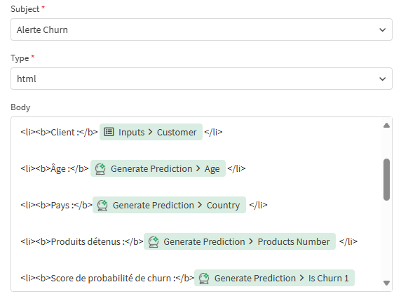

# TD 3 — Automatisation d’Alerte Email

## Objectif
Mettre en place une **automatisation intelligente** dans Qlik Cloud permettant :
- De **faire une prédiction de churn** à partir d’un formulaire.
- Et d’**envoyer automatiquement un mail d’alerte** lorsqu’un client est détecté comme risquant de quitter la banque.

---

## Étape 1 — Création de l’automatisation
1. Dans Qlik Cloud, allez dans l’onglet **Automations**.
2. Cliquez sur **Blank automation** (sans template).
3. Donnez un nom à votre flux :  `Automatisation_mail`

---

## Étape 2 — Ajout du nœud “Inputs”
1. Dans la catégorie **Basic**, ajoutez le bloc **Inputs** juste après **Start**.
2. Ce nœud servira à collecter les informations d’un client.
3. Ajoutez les paramètres suivants **exactement dans cet ordre** :

   | Label | Help text (exemple) |
   |--------|--------------------|
   | Customer | 213 |
   | Age | 58 |
   | Balance | 1500 |
   | Balance_ratio | 0.05 |
   | Active_member | 0 |
   | Products_number | 1 |
   | Country | Germany |

   *Astuce : Ces Labels doivent correspondre exactement aux paramètres du modèle entraîné dans le TD précédent:* **Best_model_Churn** 

---

## Étape 3 — Prédiction avec Qlik Predict
1. Ajoutez un bloc **Generate Prediction** *(catégorie Qlik Predict)*.  
2. Reliez le nœud **Inputs** à **Generate Prediction**.
3. Dans ses paramètres :
   - Cliquez sur **Do lookup** pour le champ **Deployment ID**  
     → Sélectionnez votre model deployé `Best_model_Churn`
   - Activez :`Include SHAP` et `Include SOURCE` 

---

## Étape 4 — Configuration des Features
Dans la section **Features** de **Generate Prediction**, cliquez sur **Add item** pour **chaque variable du modèle** :
   - **Key** → nom de la variable (`age`, `balance`, etc.)
   - **Value** → `Inputs > <nom de la variable>`

   *Cela lie vos champs du formulaire aux variables du modèle prédictif.*

---

## Étape 5 — Test de la prédiction
1. Ajoutez un nœud **Output** (catégorie Basic) pour visualiser le résultat.
2. Lancez l’automatisation.
3. Un formulaire s’affiche avec les champs créés dans “Inputs”.  
   → Remplissez les valeurs données dans le help text (un cas de client “churn”).
4. Quelle variable a eu le plus d’impact sur la prédiction ?  


---

## Étape 6 — Création de l’alerte email
On va maintenant envoyer un mail si le modèle détecte un **churn (is_churn_predicted = 1)**.

### 6.1 Supprimez le nœud “Output”
Revenez dans l’onglet **Edit**, puis supprimez le nœud Output précédent.

### 6.2 Ajoutez une **Condition**
1. Dans **Basic**, ajoutez le bloc **Condition**.
2. Paramétrez :
   - **Input** : `Output from Generate Prediction` → `is_churn_predicted`
   - **Operation** : `=`
   - **Value** : `1`

---

## Étape 7 — Envoi du mail d’alerte
1. Dans la branche **Yes**, ajoutez un bloc **Mail**.  
2. Connectez-le et configurez la connexion SMTP Gmail dans **Connection** :

   | Champ | Valeur |
   |--------|--------|
   | Host | `smtp.gmail.com` |
   | Port | `465` |
   | Security | `SSL` |
   | Sender Email | `test.qlik.churn@gmail.com` |
   | Username | `test.qlik.churn` |
   | Password | `hntg fhfe pwlo gdbn` |

3. Dans **Inputs**, remplissez :

   - **To** : votre adresse personnelle  
   - **Subject** : `[Alerte Churn détectée]`
   - **Type** : `html`

4. Dans le **Body**, copiez le contenu suivant :

   ```html
   <p>Bonjour,</p>
   <p>Une alerte de churn vient d’être détectée dans le modèle prédictif :</p>

   <ul>
     <li><b>Client :</b> </li>
     <li><b>Âge :</b> </li>
     <li><b>Pays :</b> </li>
     <li><b>Produits détenus :</b> </li>
     <li><b>Score de probabilité de churn :</b> </li>
   </ul>

   <p><b>Recommandation :</b><br>
   Veuillez prioriser une action de fidélisation :<br>
   – Vérifier la satisfaction du client.<br>
   – Lui proposer un produit à forte valeur ajoutée.<br>
   – Contacter le client sous 24h.</p>

   <hr>
   ```

5. Ensuite, insérez les **valeurs dynamiques** :
   - Pour *Client* → cherchez `Inputs > Customer`
   - Pour les autres champs → cherchez dans `Output from Generate Prediction`

#### Indication
1. Dans le bloc **Send Mail → Inputs → Body**, cliquez **dans le texte HTML** à l’endroit voulu  
   (par ex. juste après `</b> ` et avant `</li>`).
2. À droite du champ **Body**, cliquez sur le **sélecteur de valeurs** (la petite icône de données).
3. Choisissez la source :
   - **Inputs** → pour le champs Customer.
   - **Output from Generate Prediction** → pour les champs calculés par le modèle.
4. Sélectionnez le champ à insérer → un **jeton** s’ajoute au texte (il sera évalué à l’exécution).

* Selon ta configuration de modèle, le champ de probabilité peut s’appeler **`is_churn_1`** (classe positive)

---

## Étape 8 — Vérification et test
1. Ajoutez un **Output** final pour visualiser la sortie du modèle.
2. Exécutez votre automatisation :
   - Remplissez le formulaire avec les données du client.
   - Si la probabilité de churn est élevée (`is_churn_predicted = 1`), vous recevrez un **mail d’alerte automatique**.

---

## Résultats attendus

### 1. Body du mail
<p align="center">
  
</p>

### 2. Automatisation final Qlik
<p align="center">
  
</p> 


