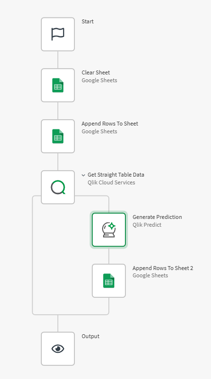

# TD4 — Automatisation : Export et Croisement des Prédictions dans Google Sheets

## Objectif
Mettre en place une automatisation dans **Qlik Cloud** permettant d’**extraire les données d’une table d’analyse**,  d’**appliquer un modèle prédictif AutoML**, et d’**enregistrer automatiquement les résultats dans Google Sheets** pour analyse et comparaison des prédictions.

---

## Étape 1 — Création de l’automatisation

1. Dans **Qlik Cloud**, allez dans l’onglet **Automations**.  
2. Cliquez sur **Blank automation** *(sans template)*.  
3. Donnez un nom à votre flux :  
   > `Automatisation_Prediction_GoogleSheet`

---

## Étape 2 — Préparation du Google Sheet

1. Créez une nouvelle feuille dans **Google Sheets**.  
2. Copiez le **Spreadsheet Id** du document à partir de l’URL :  
   ```
   https://docs.google.com/spreadsheets/d/{Spreadsheet Id}/edit?gid=0
   ```
3. Conservez le **Spreadsheet Id**, il sera utilisé dans Qlik Cloud.

---

## Étape 3 — Connexion et nettoyage du Google Sheet

1. De retour dans **Qlik Cloud Automations**, après le bloc **Start**,  
   ajoutez un nœud **Clear Sheet** *(Google Sheets Connector)*.  
2. Renseignez les champs :  
   - **Spreadsheet Id** → collez l’ID récupéré  
   - **Sheetname** → `le nom de la feuille` 
3. Dans l’onglet **Connection**, connectez-vous à votre **compte Google** (le même que celui utilisé pour créer la feuille).  

> Ce nœud permet de **vider la feuille** avant chaque nouvel export pour éviter les doublons.

---

## Étape 4 — Ajout du nœud “Append Rows to Sheet”

1. Ajoutez un nœud **Append Rows to Sheet**.  
2. Renseignez :  
   - **Spreadsheet Id** : le même que précédemment  
   - **Sheetname** : le même que précédemment   
3. Dans **Data Matrix**, insérez la structure suivante correspondant aux colonnes de sortie du modèle et la boucle :  

   ```json
   [[
     "automl_row_index",
     "age",
     "products_number",
     "active_member",
     "country",
     "balance",
     "balance_ratio",
     "customer_id",
     "is_churn",
     "is_churn_predicted",
     "is_churn_0",
     "is_churn_1",
     "products_number_SHAP",
     "age_SHAP",
     "active_member_SHAP",
     "balance_ratio_SHAP",
     "country_SHAP",
     "balance_SHAP",
     "not_predicted_reason"
   ]]
   ```

---

## Étape 5 — Création de l’application d’analyse

1. Revenez dans **Qlik Cloud (Accueil)**.  
2. Recherchez le fichier **`Churn_val_filtred.qvd`** (créé dans le **TD1**).  
3. Cliquez dessus, puis en haut à droite, sélectionnez :  
   > **Créer une application analytics**  
4. Nommez-la :  
   > `Application_Churn_val_Filtred`

---

## Étape 6 — Création de la table d’analyse

1. Ouvrez l’application `Application_Churn_val_Filtred`.  
2. Cliquez sur **Nouvelle analyse**.  
3. Dans le panneau **Graphiques / Charts**, sélectionnez **Table**.  
4. Glissez-déposez les **champs** dans la table pour afficher les donnée.

---

## Étape 7 — Récupération des données de la table dans l’automatisation

1. Retournez dans **Automations**.  
2. Ajoutez un nœud **Get Straight Table Data** *(Qlik Cloud Services)*.  
3. Configurez :  
   - **App ID** → cliquez sur **Do Lookup** et sélectionnez `Application_Churn_val_Filtred`.  
   - **Sheet ID** → **Do Lookup**, choisissez la feuille où se trouve la table.  
   - **Object ID** → **Do Lookup**, sélectionnez `XXXX - table - row 0 col 0**`.  
4. Ajoutez un **nœud Output** à la fin *(hors de la boucle)* pour vérifier si les données sont bien récupérées.
5. Lancer l'automatisation.

---

## Étape 8 — Boucle de génération des prédictions

Dans la boucle de `Get Straight Table Data`  :

1. **Ajoutez un nœud Generate Prediction** *(Qlik Predict)*.  
   - **Model Deployement ID** : faites un **Do Lookup** pour sélectionner le modèle déployé (ex. : `Best_model_Chrn`).  
   - **Features** : mappez les champs dans cet ordre pour rester cohérent avec le Google Sheet :  
     `age, products_number, active_member, country, balance, balance_ratio, customer_id, is_churn`
     > Pour `customer_id` et `is_churn`, les clés (Key) doivent être saisies manuellement.

2. **Ajoutez un nœud Append Rows To Sheet** pour insérer les prédictions dans Google Sheets.  
   - **Spreadsheet Id** : le même que précédemment  
   - **Sheetname** : le même que précédemment   
   - **Data Matrix** : utilisez le **jeton de sortie du nœud Generate Prediction**  
   - **Insert Data Option** : `INSERT_ROWS`  
   - **Connection** : sélectionnez la connexion Google Sheet configurée précédemment

---

## Étape 9 — Test et validation

1. Exécutez l’automatisation.  
2. Ouvrez votre **Google Sheet** :  
   Les lignes se remplissent automatiquement avec les prédictions et les valeurs réelles (`is_churn` et `is_churn_predicted`).  

> Vous pouvez ensuite exploiter cette feuille pour croiser les valeurs réelles et prédites,  
> visualiser les écarts et suivre la performance du modèle.

---

## Résultat attendu

<p align="center">
  
</p>