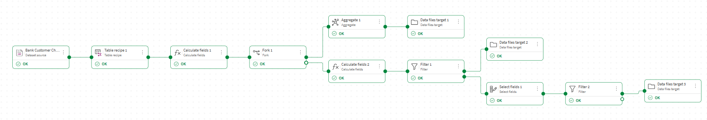

# Qlik Dataflow MLOps Workshop

**Atelier pratique** sur la création d’un pipeline de données automatisé et l’expérimentation de modèles de Machine Learning dans **Qlik Cloud**.

  

---

## Vue d’ensemble

Cet atelier s’articule autour de **trois grands axes complémentaires** :

01. **Flux de données** — Construction et préparation du pipeline de données dans Qlik Sense.   **Data Flow**
02. **Expérimentation ML** — Entraînement, évaluation et interprétation d’un modèle de prédiction de churn.   **Qlik AutoML, Qlik Predict**
03. **Automatisation** — Déploiement des prédictions, alertes **mails** automatiques et intégration avec Google Sheets. **Automation**

---

## Objectifs

L’objectif de cet atelier est de comprendre **les facteurs qui influencent le départ des clients** (“churn”) et de construire un modèle capable de **prédire quels clients risquent de partir**.  
C’est un cas d’usage classique en **analyse prédictive et fidélisation client**, très utilisé dans les secteurs de la **banque**, des **télécoms** et de la **distribution**.

Sur le plan technique, l’atelier vise à :

- Construire un **flux de données complet (ETL)** dans Qlik Sense.  
- Entraîner et évaluer un **modèle de prédiction de churn** avec Qlik Predict.  
- Mettre en place une **chaîne d’automatisation** intégrant alertes, reporting et synchronisation avec Google Sheets.

---

#### Travaux Dirigés

|  Thème | Lien |
|-------|------|
|  **Flux de Données (ETL)** | [Voir](./01_TD_Flux_Donnees.md) |
|  **Modélisation & Prédiction (Qlik AutoML)** | [Voir ](./02_TD_Modelisation.md) |
|  **Automatisation & Alertes** | [Voir](./03_TD_Automation_Alerte.md) |
|  **Déploiement des Prédictions vers Google Sheets** | [Voir ](./04_TD_Automatisation_Prediction_GoogleSheet.md) |

---

#### Contexte
L’objectif est de comprendre **les facteurs qui influencent le départ des clients** (“churn”) et de construire un modèle capable de **prédire quels clients risquent de partir**.  
C’est un cas d’usage classique en **analyse prédictive et fidélisation client**, très utilisé dans la banque, les télécoms ou la distribution.

## Thèmes abordés

### 01. Flux de données (Data Pipeline)

- **Import initial du dataset brut** : `Bank Customer Churn Dataset.csv`.  
- **Nettoyage et préparation** :
  - Gestion des valeurs manquantes et des types de données.
  - Standardisation des libellés.
  - Création de nouvelles variables dérivées (ex. `balance_ratio`, `active_member`).
- **Découpage en sous-jeux** :
  - `churn_train.csv` (pour l’entraînement du modèle)
  - `churn_val.csv` (pour la validation/test)

Cette étape permet de construire un **pipeline de données propre et reproductible**, base de toute expérimentation ML et automatisation ultérieure.

### 02. Expérimentation ML & Déploiement (Qlik Predict)
- Entraînement de modèles de classification (is_churn = 0/1).  
- Évaluation (Accuracy, Recall, Precision, F1-score, AUC/ROC).  
- Génération de prédictions sur le jeu de validation.  
- Interprétation des résultats (SHAP values).  

| Liste des modèles AutoML | Matrice de confusion |
|:--------------------------:|:--------------------:|
|  |  |

### 03. Automatisation & Intégration
- Alertes e-mail personnalisées (SMTP Gmail + HTML).  
- Écriture automatique des prédictions dans **Google Sheets**.  
- Rafraîchissement et visualisation dans une app analytique Qlik (Matrice de confusion, KPI, Importance des variables).  

---

## Compétences démontrées

- Data engineering et automatisation avec **Qlik Application Automation**  
- Machine Learning opérationnel (MLOps) avec **Qlik Predict**  
- Intégration inter-apps (**Google Sheets**, **SMTP**, **Qlik Cloud Services**)  
- Visualisation analytique et reporting dynamique  

[Voir la presentation](./Qlik_Atelier.pdf)

